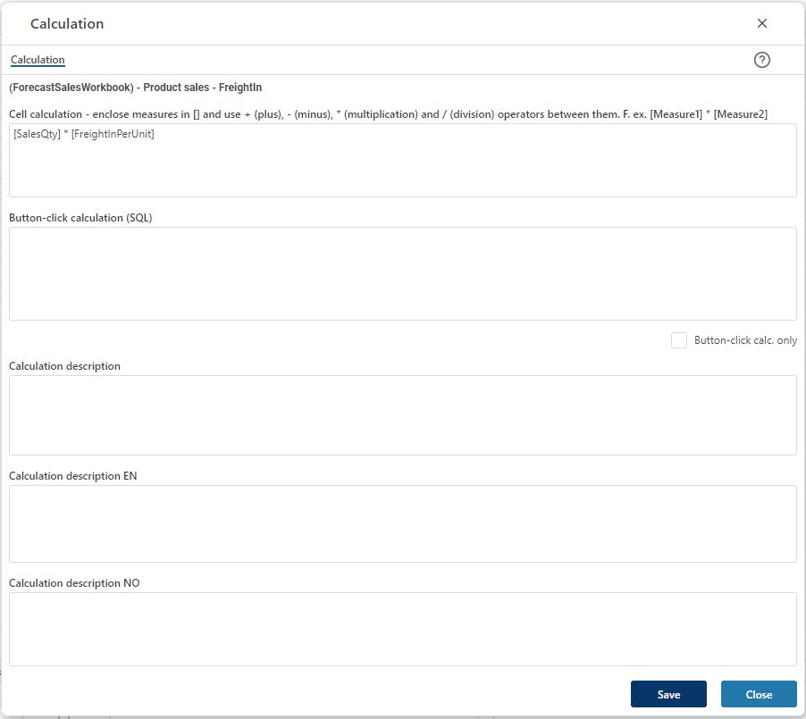

## Overview
This page allows you to define a calculation tied to a model measure.
 

There are two types of calculations: 

-	Cell-calculations: simple arithmetic calculations (+ - * /) between measures of a model. These calculations are performed automatically, as-you-type, when editing data in the input model. 

Note that when defining the cell-calculation formula, the measures are defined by the measure id enclosed in square brackets, for example [SalesQty] * [SalesUnitPrice]. 

-	Button-click calculations: more complex calculations involving for example conditionals. Such calculations are defined as SQL statements and will not calculate automatically, as-you-type, when editing data in the input model. These calculations will require the click of a button to execute, specifically the “Recalculate” button. 

In the calculation dialogue, one can also enter more elaborate descriptions using the “Calculation description” fields. 

Click "Save" to save any changes made. 
Click "Close" to close the dialogue.

 

