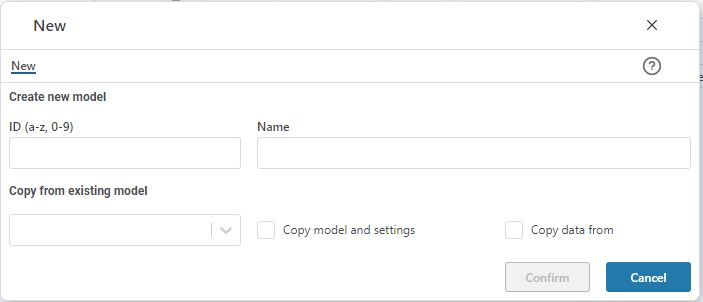

## Overview
This page allows you to create a new sales forecast model.
 

In the dialogue, enter a model id (characters a-z and 0-9 only) and a model default name. 

If relevant, select an existing model to copy from and select whether to copy only the model and settings or the input data as well. 

Click “Confirm” to create the model. 
Click "Cancel" to exit the dialogue without creating a new model.
