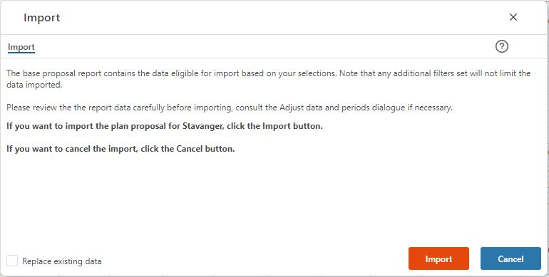

## Overview

This is where the import of the proposal is done. 

Note that the import is sensitive to the selection made in the organizational filter. By selecting a specific (lowest) level node, the import can be done for the node in question. Otherwise (no selection is made in the organizational filter, or a higher level selection is made), the import will affect the complete organization.

Note also that, by default, proposal data is added to the existing data in the module. You can, however, opt to replace existing module data by checking the "Replace existing data" check box. If contributors have started their detailed planning input, the "Replace existing data" options should be used with care as it will may lead to input data being replaced.

 

Consider the organizational scope of the import and whether or not to replace existing module data. Click the Import button to import the proposal to the input module. Click the Cancel button to cancel the operation.