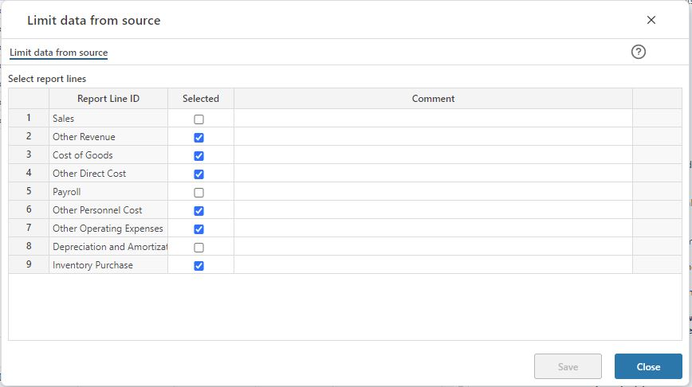

## Overview

In this screen, the report lines that constitute the report found in the Plan overview workbook are displayed. Typically, the account module is used for only a subset of these report lines. If so, the proposal should be narrowed down to reflect this.

This is done by un-checking the report lines for which the account module is not used or does not require a pre-filled proposal.

 

Un-check as appropriate and click the Save button.