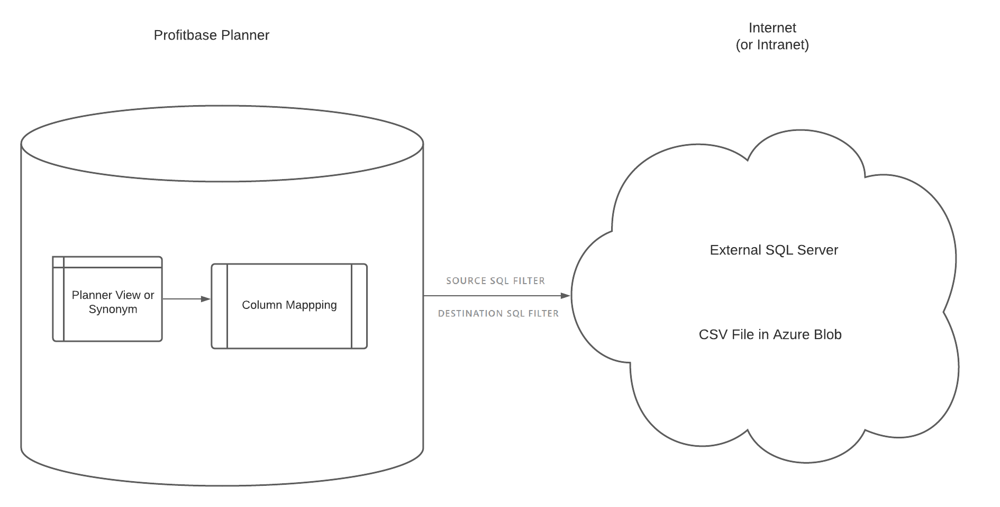
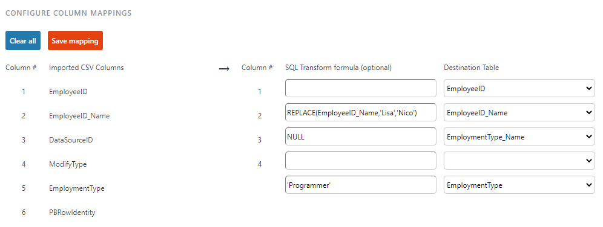
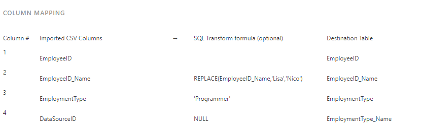

## Overview

This module is used to export data from Profitbase Planner to external sources, such as CSV files in Azure blob storages or any SQL database made available.
 

Each export "ruleset" created can either be started manually from the Data Export module, or be used to generate an operation (todo: link to Operation Manager).
 

The general principle for Data Export jobs is:
 
 
1 - Select a source within Profitbase Planner.
 
2 - Column Mapping must be set up to match the correct columns between the source table or view, and the actual destination table. This step allows for SQL transform formulas.
 
3 - Once the column mapping has been set up, the "Execute Now" button will become active. This button will then do execute the export job and move the data using the column mapping rules to the destination table.
 

 

Buttons will become active once the required information has been set up.

 

#### Creating a new RuleSet for Data Export
 
Click an existing RuleSet in the list to open it.
 
Click the "Add ruleset" button above the list to create a new ruleset.
 
Each section for the ruleset will be described below.
 

 

##### DATA EXPORT RULESET

 
<b>Ruleset name:</b> A short name for the data import job, so it can easily be identified in the list.
 
<b>Data Source:</b> Current options are defined by a Profitbase Planner admin. Typically, these will be Views or Tables accessed via a synonym. A preview button will show up to 200 rows of that data. Click the arrow behind preview, to view the "Create Table Statement": this is useful if you need to create a copy of that table somewhere. For instances hosted by Profitbase, an export to Excel is also available.
 
<b>Select Export Name:</b> If the source contains a column called "ExportName" (compound views), selection is mandatory.
 
<b>SQL WHERE clause on source: (Optional):</b> Filter the source with custom SQL code. Do not specify the keyword "WHERE", just the conditions.
 
<b>Connection:</b> Select a [Connection](/planner/workbooks/data-management/connections) from the list. Changing this field will trigger an automatic save.
A "Test Connection" button is available, and will also be automatically triggered when loading a ruleset with a connection. A "browse" button will be enabled for valid Azure Blob connections, to view the files.

 

##### CONFIGURE DESTINATION: AZURE BLOB STORAGE - CSV FILE (Option 1)

 
<b>File name:</b> The file will be created with that name. If a file exists with the same name, it will be overwritten.
 
<b>Column delimiter:</b> The symbol used inside the CSV file to separate the columns. Typical values are either <b>,</b> or <b>;</b>
 
<b>Text qualifier:</b> The symbol used inside the CSV file to wrap data strings. Most common is <b>"</b>
 
<b>Date Format:</b> Leave as default, or enforce a transform format for all dates and datetimes.
 

 

##### CONFIGURE DESTINATION: DIRECT SQL (Option 2)

 
<b>Destination table:</b> Select from the list of tables on the destination. If the connection fails, this list will be empty.
 
<b>Select delete method:</b> Select from the list of options:
 
 - Append all: All data will be added to the destination.
  
 - Replace all: All data in the destination will be replaced. "Truncate" will be faster but require elevated permissions.
  
 - Custom SQL: Write the SQL where clause to select what data will be removed from the destination.
  
 - Stored Procedure: Select from the list of stored procedures found on the destination.
 

##### COLUMN MAPPING

 
Mandatory step to perform the copy of data from the SQL temporary table to the final destination.
 
This will tell the system which column to put where, as the column names don't necessarily match.
 
Here is a basic example:
 

 
EmployeeID will be imported as-is.
 
If the Employee name is "Lisa", it will be replaced with "Nico". This can be used to add any logic, and may even reference other columns.
 
EmploymentType_Name will be left to NULL for all rows in the destination, regardless of imported data (no string delimiters).
 
EmploymentType will be "Programmer" for all rows in the destination, regardless of imported data (note the string delimiters).
 
ModifyType and PBRowIdentity will be ignored.
 
After the column mapping has been saved, a summary will be displayed in the final section:
 

 
Clicking auto-cast, will use any mappings set up, and automatically add a transform formula. If transforms have already been added, they will be wrapped in this additional casting.

 

##### (Optional) Creating Operations to automate Data Exports

To run an export job, click the "Execute Now" button.
 
This will perform all the steps above, which consists of one step, a dataflow with an argument (the export ruleset GUID).
 
If you wish to automate this job or just expose it to the "Operation Manager" module of the Profitbase Planner, the "Create Operation" button will create an operation with the same name as the ruleset, under the application "EPMDataMart" and the category "Data Export".
 

## Related Pages

[Data Import](/planner/workbooks/administration/data-import/import-data)
[Scheduled Operations](/planner/workbooks/administration/OperationManager/ScheduledOperations)
[Operations](/planner/workbooks/administration/OperationManager/Operations)
