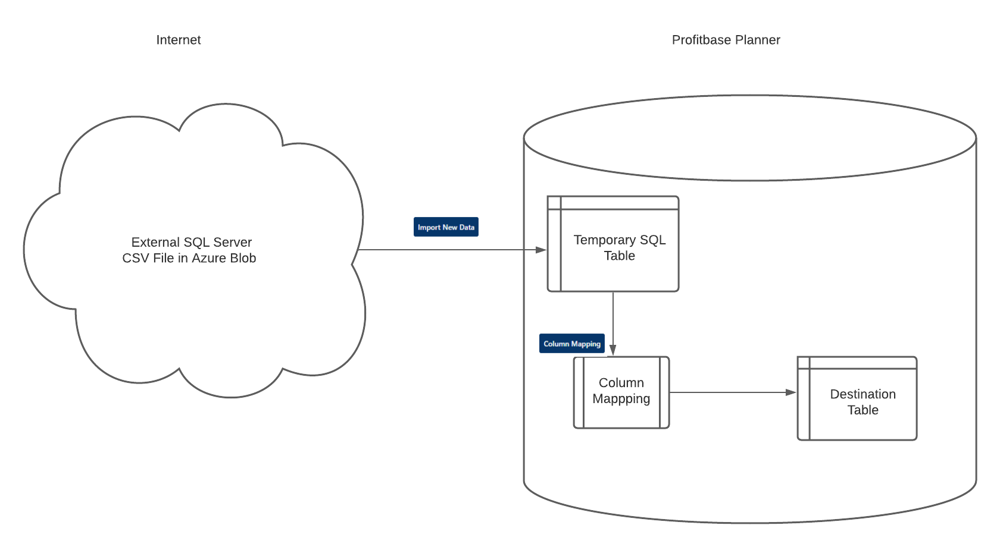

## Overview

This module is used to import data from external sources, such as CSV files from an Azure blob storage or any SQL database accessible from the Planner database.
 

Each import "ruleset" created can either be started manually from the Data Import module, or be used to generate an operation (todo: link to Operation Manager).
 

The general principle for Data Import jobs is:
 
 
1 - Data must first be copied into an SQL temporary table, within Profitbase Planner.
 
2 - Column Mapping must be set up to match the correct columns between this temporary table and the actual destination table. This step allows for SQL transform formulas.
 
3 - Once the column mapping has been set up, the "Execute Now" button will become active. This button will then do everything: import data into the internal temporary table, and copy that data using the column mapping rules to the final destination table.
 

 

Buttons will become active once the required information has been set up.
 

 

#### Creating a new RuleSet for Data Import
 
Click an existing RuleSet in the list to open it.
 
Click the "Add ruleset" button above the list to create a new ruleset.
 
Each section for the ruleset will be described below.
 

 

##### DATA IMPORT RULESET

 
<b>Ruleset name:</b> A short name for the data import job, so it can easily be identified in the list.
 
<b>Destination store:</b> Select the planner destination from the list. This is the final destination for the imported data. Changing this field will trigger an automatic save.
 
<b>Connection:</b> Select a [Connection](/planner/workbooks/data-management/connections) from the list. Changing this field will trigger an automatic save.
A "Test Connection" button is available, and will also be automatically triggered when loading a ruleset with a connection. A "browse" button will be enabled for valid Azure Blob connections, to view the files.
 
<b>Select method:</b>
 
- Append all data to the destination table: all new data will be added and all existing data will remain intact.
 
- Custom (SQL) WHERE clauses: this option is the most flexible, and will make use of the "SOURCE SQL FILTER" and "DESTINATION SQL FILTER" sections.
 
Example : We have set up an import job to import data from any data source into the "Employees", which has a column name "UserName".
 
Example Source SQL filter: UserName = 'Nico' - Only data from the source matching UserName = 'Nico' will be imported.
 
Example Destination SQL filter: UserName = 'Nico' - Only data in the destination matching UserName = 'Nico' will be <b>replaced</b>.
 
- Replace all data to the destination table: existing data in the final destination will be wiped and replaced with the new import.
 
For the replace method, 2 optional checkboxes:
 
    * "Keep existing data if no rows loaded": This will abort the final step if the temporary table is empty.
     
    * "Abort if rows decrease": This will abort the final step if the temporary table has less rows than the destination.
 
These 2 options are particularly useful when import jobs are automated with [Scheduled Operations](/planner/workbooks/administration/OperationManager/ScheduledOperations)

 

 

##### CONFIGURE SOURCE: AZURE BLOB STORAGE - CSV FILE (Option 1)

 
<b>File name prefix:</b> The blob storage may contain multiple files, so we must specify the first few letters of files the import job must look for.
 
<b>Column delimiter:</b> The symbol used inside the CSV file to separate the columns. Typical values are either <b>,</b> or <b>;</b>
 
<b>Text qualifier:</b> The symbol used inside the CSV file to wrap data strings. Most common is <b>"</b>
 
<b>Automatically move blob files after processing (auto cleanup)</b> If this option is active, files will be moved into an <b>Archive</b> folder in the blob storage. The purpose is to handle automatic updates, and prevent re-using the same file, if, for example, another automatic routine adds new files every day/week/month.
 
<b>Custom (SQL) WHERE clause on source:</b> Filter the source data using an SQL expression. This can reduce the number of rows imported, if you only need a subset. Do not include the key word "WHERE" at the start, just the filter.
 

##### CONFIGURE SOURCE: DIRECT SQL (Option 2)

 
<b>Select Query:</b> The SQL query used to get the data to import. This can be any valid SQL query: you may use joins or "where" filters to completely customize what data to import. The "Browse" button is only meant as a helper for this step to get the correct table and column names without needing SQL Management Studio.
 
<b>Browse:</b> (Optional) Helper popup to browse the tables and suggest a select query that you may copy paste for the next step. The "auto-collate option" will add collation code to match the destination database on text fields. The "use suggested query" will add that query to the above mentioned field, so you don't have to maually copy paste it. You may add a WHERE clause if needed.
 
 

##### CONFIGURE TEMPORARY TABLE

 
Enter the name for the temporary table to be used. It will be prefixed with DataImport_ automatically.
 
When all the necessary fields have been filled, the "Import New Data" button will become active.
 
Instances hosted by Profitbase will use a much faster method, which is impossible with "on premise" installations.
 
A preview button can be used to view the status of that table (if it exists).
 
Once the temporary data has data, the column mapping must be set up between this temporary (staging) table and the final destination, as column names or types could differ.

##### COLUMN MAPPING

 
Mandatory step to perform the copy of data from the SQL temporary table to the final destination.
 
This will tell the system which column to put where, as the column names don't necessarily match.
 
Here is a basic example:
 

 
EmployeeID will be imported as-is.
 
If the Employee name is "Lisa", it will be replaced with "Nico". This can be used to add any logic, and may even reference other columns.
 
EmploymentType_Name will be left to NULL for all rows in the destination, regardless of imported data (no string delimiters).
 
EmploymentType will be "Programmer" for all rows in the destination, regardless of imported data (note the string delimiters).
 
ModifyType and PBRowIdentity will be ignored.
 
After the column mapping has been saved, a summary will be displayed in the final section:
 

 

 

##### (Optional) Creating Operations to automate Data Imports

To run an import job, click the "Execute Now" button.

This will perform all the steps above, which consists of one step: a dataflow with an argument (the import ruleset GUID).

If you wish to automate this job or just expose it to the "Operation Manager" module of the Profitbase Planner, the "Create Operation" button will create an operation with the same name as the ruleset, under the application "EPMDataMart" and the category "Data Import".

If you select multiple rulesets on the ruleset selection screen, that "Create Operation" button will create one operation with all the selections. The default name of the operation will become all ruleset names, comma separated (but may be renamed).

## Related Pages

[Scheduled Operations](/planner/workbooks/administration/OperationManager/ScheduledOperations)
[Operations](/planner/workbooks/administration/OperationManager/Operations)
