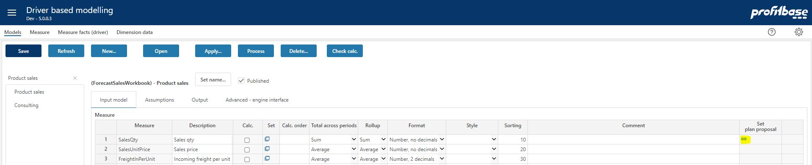
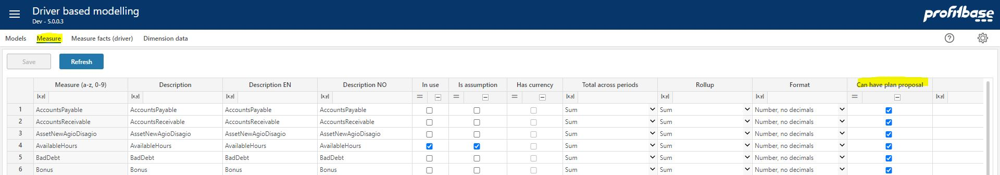

**Applies to:**  Planner 5 or later 

### Overview
In some cases it may be desirable to pre-fill an input module with a proposal so that the contributors can have a qualified starting point for their work. As such, a plan proposal will normally be made in a new version prior to the users starting the detailed planning. Such a proposal can be created for eligible measures in driver based models Driver based plan proposal workbook.

Please note that this workbook can only be reached via the Driver based modelling workbook, more specifically by selecting a model and clicking the link icon for the relevant measure for which you would like to set a plan proposal:

Eligible measures are those defined as input measures of the model and have the "Can have plan proposal" attribute checked (default checked):

The process of defining such a proposal contains of two steps:

1. Create basis proposal - define the and adjust the data source(s) that will constitute the proposal.
2. Create the basis proposal and further refine it before importing it into the input module.

 

### Related Pages
-  [1. Create basis proposal](driver-based-plan-proposal/create-basis-proposal.md)
-  [2. Adjust basis proposal and import](driver-based-plan-proposal/adjust-basis-proposal-and-import.md)

 

### How to`s

 

> **Input Modules** 

**Applies to:**  Planner 5.2 or later
-  [Configure the Driver based module](https://profitbasedocs.blob.core.windows.net/enduserhelp/files/V5.2/Planner%20Driver%20based%20module.pdf) 
 

**Applies to:**  Planner 5.0 or 5.1
-  [Configure the Driver based module](https://profitbasedocs.blob.core.windows.net/enduserhelp/files/v5/Planner%20Driver%20based%20module.pdf) 
