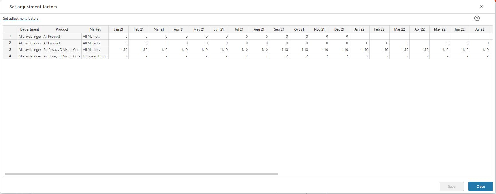

## Overview

If a 1:1 mapping of values from the source to the plan proposal is not desired, this is where to set factors to change that. These factors can be detailed along the organizational, product and market dimensions and for the individual plan periods.

Note that all dimensions are set based on their hierarchies allowing for high level or ranked input. Please refer to the general description of ranked input selection [Common functionality](../../../getting-started/common-functionality.md)  

 

Add rows for the selections of the proposal that should be factored differently from a 1:1 mapping from the source. Click the Save button to save any changes.