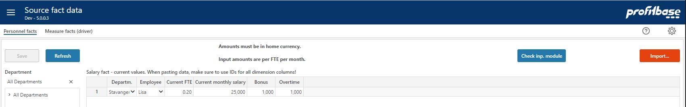
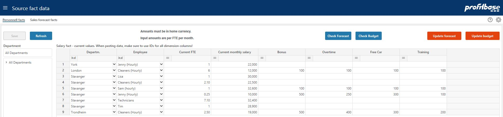

## Overview
This is the Personnel facts page that allows you to input personnel fact data as the basis for the personnel input module.
 

**Applies to:**  Planner 5 or later

**Applies to:**  Planner 4.x

 
The fact source data contain current FTE, monthly salary and other personnel data (subject to configuration) data per department/employee combinations:

 ## Column Descriptions

- **Departm.:** 
The department id, mandatory.

- **Employee:** 
The employee id, mandatory.

- **Current FTE:** 
The current FTE position of the employee at the given department. Note that when initializing the budget and forecast, this value will be used as the initial planned FTE.

- **Current monthly salary:** 
The current monthly salary for a full time FTE for the employee at the given department. Note that when initializing the budget and forecast, this value will be used as the base monthly salary for the plan.

- **Additional columns subject to configuration ("Bonus", "Overtime", "Free car" and "Training" in the example):** 
Per-month-per-FTE initial values. Note that when initializing the budget and forecast, these values will be taken as the initial, planned values.

**Applies to:**  Planner 4.2 or later

- **Project:** 
The project id, optional (visibility depends on configuration). If no value is provided, the default value # is set.

- **Activity:** 
The activity id, optional (visibility depends on configuration). If no value is provided, the default value # is set.

- **Dim1:** 
The free dimension 1 id, optional (visibility depends on configuration). If no value is provided, the default value # is set.

- **Dim2:** 
The free dimension 2 id, optional (visibility depends on configuration). If no value is provided, the default value # is set.

- **Dim3:** 
The free dimension 3 id, optional (visibility depends on configuration). If no value is provided, the default value # is set.

- **Dim4:** 
The free dimension 4 id, optional (visibility depends on configuration). If no value is provided, the default value # is set.

**Applies to:**  Planner 5 or later

- **VacationPayPctOvr:** 
Vacation pay percentage override, optional (visibility and heading depend on configuration).

- **EmployerTaxPctOvr:** 
Employer tax percentage override, optional (visibility and heading depend on configuration).

- **PensionEmployerPctOvr:** 
Pension (employer's share) percentage override, optional (visibility and heading depend on configuration).

- **PensionEmployeesPctOvr:** 
Pension (employee's share) percentage override, optional (visibility and heading depend on configuration).

 

Add new rows as needed or paste selection. When pasting data, make sure to paste dimension ids. A dropdown will evaluate the id against the corresponding dimension and render the dimension description. If no description is rendered, just the id, this indicates that the id does not exist in the dimension.

Dimension combinations found in the source and not in the input module will automatically be processed into the module on forecast rollover.

**Applies to:**  Planner 5 or later

To check which combinations will be processed into the input module, click the  "Check inp. module" button. Revise data as appropriate and keep the source fact data

Data can be imported to the input module by clicking the "Import..." button.

**Applies to:**  Planner 4.x

To check which combinations will be processed into the budget and forecast modules respectively, “Check Budget”/”Check Forecast” buttons. Revise data as appropriate and keep the source fact data current.

Modules can be updated manually by clicking the “Update forecast”/”Update budget” buttons.

## How to`s

 

**Applies to:**  Planner 5.4 or later

-  [Configure the Personnel module](https://profitbasedocs.blob.core.windows.net/enduserhelp/files/v5.4/Planner%20Personnel%20module.pdf) 
-  [Planner Data Requirements](https://profitbasedocs.blob.core.windows.net/enduserhelp/files/V5.4/Planner%20Data%20Requirements.pdf) 

 

**Applies to:**  Planner 5.2.4 or later

-  [Configure the Personnel module](https://profitbasedocs.blob.core.windows.net/enduserhelp/files/v5.2.4/Planner%20Personnel%20module.pdf) 
-  [Planner Data Requirements](https://profitbasedocs.blob.core.windows.net/enduserhelp/files/v5/Planner%20Data%20Requirements.pdf) 
-  [Planner Data Requirements - import template](https://profitbasedocs.blob.core.windows.net/enduserhelp/files/v5/Planner%20Data%20Requirements%20Template.xlsx) 

 

**Applies to:**  Planner 5.0 and 5.1

-  [Configure the Personnel module](https://profitbasedocs.blob.core.windows.net/enduserhelp/files/v5/Planner%20Personnel%20module.pdf) 
-  [Planner Data Requirements](https://profitbasedocs.blob.core.windows.net/enduserhelp/files/v5/Planner%20Data%20Requirements.pdf) 
-  [Planner Data Requirements - import template](https://profitbasedocs.blob.core.windows.net/enduserhelp/files/v5/Planner%20Data%20Requirements%20Template.xlsx) 

 

**Applies to:**  Planner 4.x

-  [Configure the Personnel module](https://profitbasedocs.blob.core.windows.net/enduserhelp/files/Planner%20Personnel%20module.pdf) 
-  [Planner Data Requirements](https://profitbasedocs.blob.core.windows.net/enduserhelp/files/Planner%20Data%20Requirements.pdf) 
-  [Planner Data Requirements - import template](https://profitbasedocs.blob.core.windows.net/enduserhelp/files/Planner%20Data%20Requirements%20Template.xlsx) 
 

