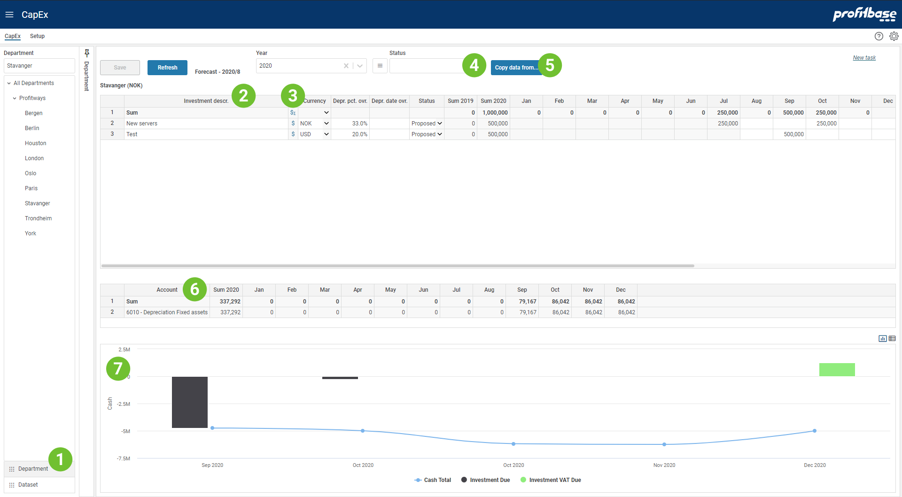

## Overview
This is the input module in which planned investments are input.

Only investments input for periods post the start of plan will be considered in the plan.
 

1. **Dataset filter**  
**Applies to:**  Planner 4.x 
The module is common to Budget and Forecast, defaulting to Forecast. To change from Forecast to Budget or vice versa, expand the left margin area, select the Dataset filter and select the appropriate dataset. 
2. **Investment description**  
Each investment should have a textual description so that they are identifiable. The Text column contains this description. 
3. **Financial report - "$" icon**  
The Financial report icon will trigger the reports and trend for the row clicked. Clicking the icon for the sum row, will trigger the reports for all rows.
4. **Status filter**  
Each investment has a status, for example Planned, Active, Rejected (subject to the solution configuration). The status filter is used to filter out loan of specific statuses.
5. **Copy data from button**  
It is possible to copy investments from one year to the currently selected year, with or without the investment amounts found in the year copied from. To copy investments from another year, click the "Copy data from.." button that will take you to a pop-up window in which you can specify where to copy data from. 
**Applies to:**  Planner 4.x 
The copy data from includes dataset.
6. **Attachment button**  
The attachment button will display the number of attachments associated with this input page in the current filter context. The current filter context is the selection made in the organizational filter (leftmost section) and the optional filters that are found in the rightmost section (subject to configuration).

To add a new attachment, click the attachment button and drag-then-drop the attachment from the file system onto the drop zone in the attachment dialogue.

To delete an attachment, click the attachment button, select the attachment and the click the Delete button (bin icon) within the attachment dialogue
7. **Account report**  
The account report displays the financial effect of the input made and is updated as input data is saved.
Note that for forecasting, the current year (this year) will consist of a set of actual periods that are read only and a set of plan periods that are editable. 
8. **Cash flow trend/report**  
Trend displaying the cash flow of the investments. Note the two buttons in the upper right corner of the trend that allows you to switch from a trend view to a tabular view and vice versa. 

 

## Video
[Introduction - Input](https://profitbasedocs.blob.core.windows.net/enduserhelp/videos/CapEx.mp4) 

 

## Column Descriptions

Note that the heading of the columns and their visibility can be configured and may thus differ from the example.

- **Investment descr.:** 
Describes the investment (mandatory)
- **Currency:** 
The currency of the investment amounts.
- **Depr. pct. ovr.:** 
The annual depreciation rate % (override) for the investment. Subject to configuration there be central settings for depreciation rate %. The override value will "win out" regardless of any central settings.
- **Depr. date ovr.:** 
The depreciation date (override) for the investment. If none is specified, the depreciation will start in the same period as the first investment amount is input.
- **Status:** 
Each investment has a status, for example Planned, Active, Rejected (subject to the solution configuration). The status filter is used to filter out investments of specific statuses.
- **Sum previous year (2019 in the example):** 
Sum of planned investments previous year.
- **Sum current year (2020 in the example):** 
Sum of planned investments this year, that is the sum of the Period columns.
- **Period columns (Jan - Dec in the example):** 
Periodic input fields to hold planned investment for current period.
- **Comments:** 
Input field enabling textual comments to be associated with the input for a specific line.

 

## How to`s

 

> [Create new task](/planner/workbooks/process-and-tasks/tasks/create-edit-task) 

**Applies to:**  Planner 5.4 or later
> [Configure the CapEx module](https://profitbasedocs.blob.core.windows.net/enduserhelp/files/V5.4/Planner%20CapEx%20module.pdf) 

**Applies to:**  Planner 5.2.4 or later
> [Configure the CapEx module](https://profitbasedocs.blob.core.windows.net/enduserhelp/files/V5.2.4/Planner%20CapEx%20module.pdf) 

**Applies to:**  Planner 5.2 
> [Configure the CapEx module](https://profitbasedocs.blob.core.windows.net/enduserhelp/files/V5.2/Planner%20CapEx%20module.pdf) 

**Applies to:**  Planner 5.0 or 5.1
> [Configure the CapEx module](https://profitbasedocs.blob.core.windows.net/enduserhelp/files/v5/Planner%20CapEx%20module.pdf) 

**Applies to:**  Planner 4.x
> [Configure the CapEx module](https://profitbasedocs.blob.core.windows.net/enduserhelp/files/Planner%20CapEx%20module.pdf) 
