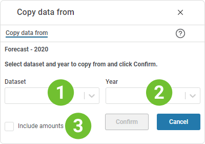

## Overview
This page allows you to copy investments from another year. This may be relevant if investments span multiple years. 
Note that the copy operation is relative to the selection made in the Department filter, e.g. when invoking the "Copy data from.." while positioned at department Stavanger, only investments for department Stavanger are copied.
 

1. **Dataset filter**  
**Applies to:**  Planner 4.x 
Select the dataset that you would like to copy from.
2. **Year filter**  
Select the year that you would like to copy from.
3. **Include amounts check box**  
This check box allows you to copy the investment amounts if checked. By default (unchecked), only the investment rows are copied leaving the amount cells empty.

Click the "Confirm" button to copy. 
Click the "Cancel" button to cancel.

 

