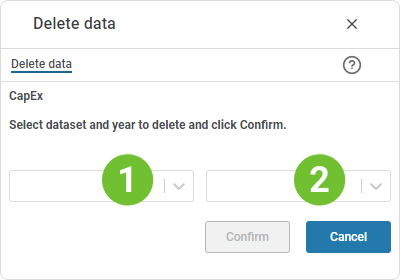

## Overview
This page allows you to delete investment data for a given year. 
This will typically be a function that you might do for historical years, i.e. in order to delete investments that are no longer relevant.
 

1. **Dataset filter**  
**Applies to:**  Planner 4.x 
Select the dataset to delete data from.
2. **Year filter**  
Select the year to delete data from.

Click the "Confirm" button to delete. 
Click the "Cancel" button to cancel.

 

