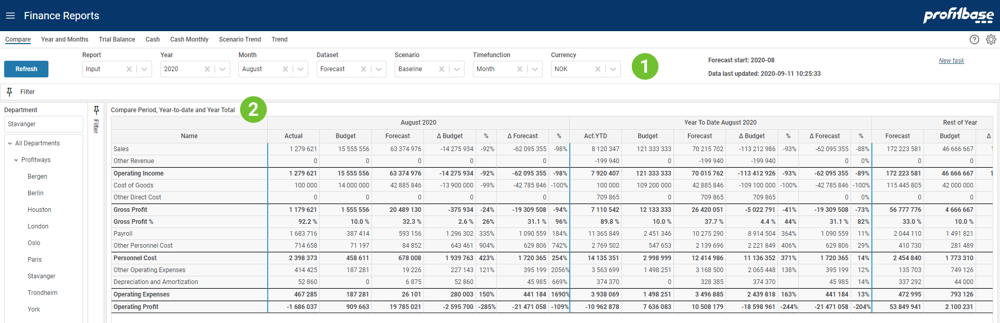

**Applies to:**  Planner 4

## Overview
This report is used for comparing actual results against budget and forecast. The forecast dataset is combining actual data up until forecast start and forecast data from forecast start and forward. 

This report contains sections to comparing the selected period, year-to-date, rest-of-year and year-total.

See an example of this report in picture below.
 

1. **Top and Left Section**  
The left section contains the Department filter and gives the ability to slice data according to an organization hierarchy. 
The top section contains mainly filter choices including selection of which report to presented. 
The upper right "Forecast start" tells which calendar period the forecast start. Since this may be a rolling forecast this period will be updated as the forecast reach next period. "Data last updated" tells when the input was last simulated to generate the full ledger. This process is normally scheduled to run at certain intervals. 

2. **Content Section**  
The content section shows the reporting lines including rows for sub-totals. The table is divided into 4 sections for comparison between actual, selected dataset (i.e. Forecast by default) and Budget:

+ **Month** Compare selected month
+ **Year To Date** Compare year to date for according to selected month
+ **Rest of Year** Compare Forecast and Budget for rest of year
+ **Year Total** Compare year outlook combining aggregating actual periods with remaining periods for Forecast and Budget

The Forecast dataset is composed of Actual data for periods before the Forecast start and Forecast input data from the Forecast start period (as shown in the upper right in the report).

## Filter Descriptions
Filter selections available apart from Department are:

- **Report** Allow selecting different report configurations.
- **Year** Select year to compare.
- **Month** Select what month to compare. This also determines the time range for year-to-date and rest-of-year.
- **Dataset** Select the dataset. Forecast is the default used here but others may be selected for comparison against Actual and Budget which are fixed in this report setup.
- **Scenario** Is used related to simulation providing the alternatives: "Baseline", "Best" and "Worst". Scenario is only relevant for Forecast and Budget datasets.
- **Timefunction** Not relevant for this report setup.
- **Currency** Choose which currency to the used in the report. Average rate for each period is used for currency conversion.

## Column Descriptions

Number-columns explained:

- **Actual**  This contains numbers from the account system.
- **Budget**  This contains numbers from Budget and Scenario = "Baseline".
- **Forecast**  This contains numbers from Forecast or another selected dataset.
- **&Delta; Budget**  This is the difference between Actual and Budget. The &#37;-column to the right shows the difference as percentage.
- **&Delta; Forecast**  This is the difference between Actual and Forecast. The &#37;-column to the right shows the difference as percentage.
- **Act.+Forecast**  This contains the sum of Actual year-to-date and Forecast rest-of-year. Note that the selected month controls the year-to-date and rest-of-year.
- **Act.+Budget**  This contains the sum of Actual year-to-date and Budget rest-of-year. Note that the selected month controls the year-to-date and rest-of-year.

## How to`s

 
[Create new task](/planner/workbooks/process-and-tasks/tasks/create-edit-task) 
