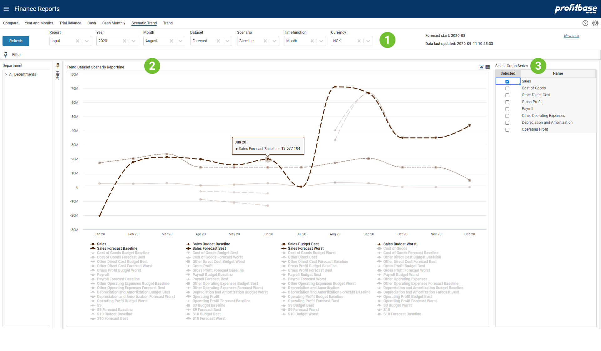

**Applies to:**  Planner 4

## Overview
This report is using splines to show the trend over time for selected report lines. To the right you can select which report lines you want to show. This report shows data from all datasets and all scenarios (only relevant for Forecast and Budget).
 Report lines available for trending (selectable item to the right) is a subset of all report lines. The set enabled for trending is configured when defining the report lines.

To use this report:

1. Select report lines on the upper right in report.
1. Make any other selections and click Refresh-button to draw the report.
1. Click on the legends on the lower part to toggle on/off individual graph-splines.

See an example of this report in picture below.
 

1. **Top and Left Section**  
The left section contains the Department filter and gives the ability to slice data according to an organization hierarchy. 
The top sections contains mainly filter choices including selection of which report to presented. 
The upper right "Forecast start" tells which calendar period the forecast start. Since this may be a rolling forecast this period will be updated as the forecast reach next period. "Data last updated" tells when the input was last simulated to generate the full ledger. This process is normally scheduled to run at certain intervals. 

2. **Content Section**  
The content section shows graph lines for all report lines that are configured enabled for trending. The Forecast dataset is composed of Actual data for periods before the Forecast start and Forecast input data from the Forecast start period (as shown in the upper right in the report).
Note that the graph is prepared to display up to 10 different report lines each with Actual, Budget and Forecast datasets and with Basis, Best and Worst scenario (i.e. scenario is not relevant for Actual dataset).

3. **Graph Selection**  
The upper right table allows for selecting the report lines to be displayed. This is to avoid too many lines being drawn at the same time which makes it difficult to see the trend from actual continuing in forecast and budget periods. 

## Filter Descriptions
Filter selections available apart from Department are:

- **Report** Allows for selecting between different report configurations
- **Year** What year to look at
- **Month** Not relevant for this report.
- **Dataset** Not relevant for this report.
- **Scenario** Not relevant for this report.
- **Timefunction** Selecting Month will show the numbers for each month. Selecting Year-to-date will show the sum of this and preceding periods. To see balanced you have to use Year-to-date.
- **Currency** Choose which currency to the used in the report. Average rate for each period is used for currency conversion.

## Graph Descriptions

Each graph line represents a reporting line enabled for trending in the selected report. The amount is plotted on a per million scale. Moving the mouse over a period, will show a shared tooltip that present all amounts for the period.

The Forecast dataset is input data only from the Forecast start period. This means that actual numbers are not part of the Forecast dataset here.

## How to`s

 

[Create new task](../../../process-and-tasks/tasks/create-edit-task.md) 
