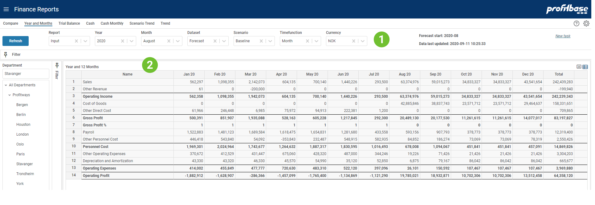

**Applies to:**  Planner 4

## Overview
This report provides a period view for selected Report showing all periods of the selected year. For Profit & Loss type of reports, a total sum over periods for the year is provided. For Balance Sheet type reports, an Opening Balance (OB) and Closing Balance (CB) are provided.

See an example of this report in picture below.
 

1. **Top and Left Section**  
The left section contains the Department filter and gives the ability to slice data according to an organization hierarchy. 
The top section contains mainly filter choices including selection of which report to present. 
The upper right "Forecast start" tells which calendar period the forecast start. Since this may be a rolling forecast this period will be updated as the forecast reach next period. "Data last updated" tells when the input was last simulated to generate the full ledger. This process is normally scheduled to run at certain intervals.

2. **Content Section**  
The content section shows the reporting lines including sub-totals per period for a selected year. The Forecast dataset is composed of Actual data for periods before the Forecast start and Forecast input data from the Forecast start period (as shown in the upper right in the report).

## Filter Descriptions
Filter selections available apart from Department are:

- **Report** This allows for selecting between different report configurations
- **Year** Select what year to look at
- **Month** Not relevant here
- **Dataset** Select dataset to be presented.
- **Scenario** This is used related to simulation providing the alternatives: "Baseline", "Best" and "Worst". Scenario is only relevant for Forecast and Budget datasets.
- **Timefunction** Selecting Month will show the numbers for each month. Selecting Year-to-date will show the sum of this and preceding periods including OB for balance type reports. To see balanced you must use Year-to-date.
- **Currency** Choose which currency to the used in the report. Average rate for each period is used for currency conversion.

## Column Descriptions
The number columns explained:

- **MMM YY**  These 12 columns contain numbers from the selected dataset.
- **Total**  Provides the sum over the above 12 columns for Profit-Loss type reports.
- **OB**  This is the Opening Balance and is only visible for Balance Sheet type reports.
- **CB**  This is the Closing Balance and is only visible for Balance Sheet type reports. This is the sum of the OB and the 12 periods.

## How to`s

 
[Create new task](/planner/workbooks/process-and-tasks/tasks/create-edit-task) 
