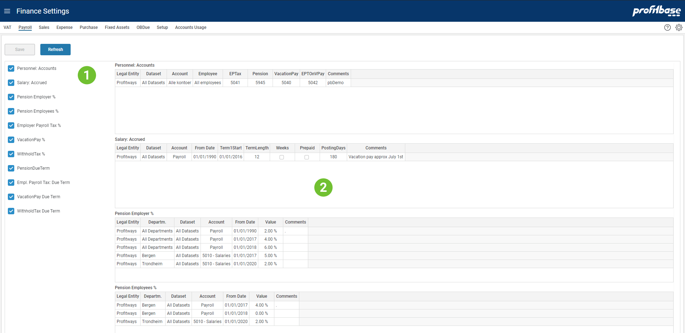

## Overview
Finance Settings contains all parameter settings that is required to do an accurate simulation of a full general ledger.

The picture below is an example that will help explain how settings is organized and which concepts is applied.

1. **Selecting Setting Table** The left area lists the different setting tables available for the page. Ticking here will turn on and off the table.
2. **Tables View** The right area will display the selected tables and allows users to edit content.
 

## Related Pages
- [VAT](/planner/workbooks/financial-planning/finance-settings/vat) 
This page contains VAT settings for the different rates and when VAT payment is due.

- [Payroll](/planner/workbooks/financial-planning/finance-settings/payroll) 
This page contains settings related to payroll.

- [Sales](/planner/workbooks/financial-planning/finance-settings/sales) 
This page contains settings related to sales.

- [Expense](/planner/workbooks/financial-planning/finance-settings/expense) 
This page contains settings related to expenses.

- [Purchase](/planner/workbooks/financial-planning/finance-settings/purchase) 
This page contains settings related to purchase of goods for sales and/or production.

- [Fixed Assets](/planner/workbooks/financial-planning/finance-settings/fixed-assets) 
This page contains settings and input for fixed assets.

- [OBDue](/planner/workbooks/financial-planning/finance-settings/obdue) 
This page contains settings for opening balance and how accounts receivable and accounts payable will be paid.

- [Setup](/planner/workbooks/financial-planning/finance-settings/setup) 
This page contains system settings for the solution.

- [Account Usage](/planner/workbooks/financial-planning/finance-settings/account-usage) 
This is a page containing a report that allows you to get an overview on where different accounts are used.

**Applies to:**  Planner 5.2 or later.

- [Advanced](/planner/workbooks/financial-planning/finance-settings/advanced) 
This page allows you to create advanced (debit/credit) postings.

- [Audit](/planner/workbooks/financial-planning/finance-settings/audit) 
This page allows you to perform a data quality audit.

**Applies to:**  Planner 5.4.0 or later.

- [Allocation](/planner/workbooks/financial-planning/finance-settings/allocation) 
This page allows you to create, maintain and check allocation rules for allocating cost between givers and bearers.

## Concepts

Often settings are used for (but not limited to):
- Tell which accounts to be used in a certain context determined by settings tables (e.g. "Personnel: Accounts" in picture above) and leftmost columns in the table and FromDate (if present)
- Define payment terms (e.g. see [VAT](finance-settings/vat) and "Due Term" table)
- Rates to be used in general ledger calculation (e.g. see "Pension Employer" in picture above)

All settings tables contain a set of keys where most keys allow for using wildcard (the * character). The key columns are always placed to the left in the table and in general all columns to the left of FromDate are key columns. The key columns together with FromDate decide which settings row are applicable whenever used.

FromDate is used to make changes in setting over time (e.g. see "Pension Employees" above for changes in FromDate and percent value).

## Example

Consider the following salary transaction:
LegalEntity = "Profitways", Department="ADMIN", PayrollDate=2020-09-30, Account=5000 (in Payroll group)

This will give a Pension Employer Value = 6 % because this is the last rate set in FromDate = 2018-01-01. This is for any department and any dataset in Profitways for all accounts in the Payroll account group.

Note that you can make it very complicated and create a mess if you are using a mix of wildcards and items across multiple columns. You are advised to keep this simple and verify that your settings are working as intended.

 

## See also
-  [Opening Balance](/planner/workbooks/financial-planning/opening--balance) 
Adjust opening balance for Forecast and Budget.

 
