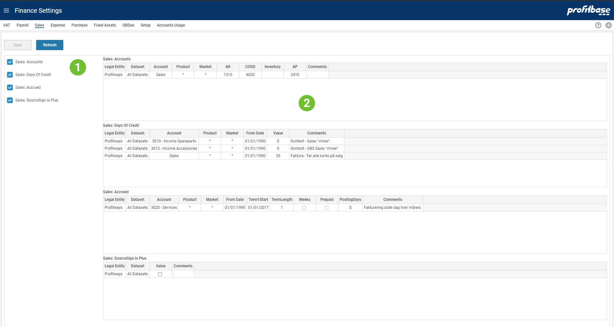

## Overview
In publishing and graphic design, Lorem ipsum is a placeholder text commonly used to demonstrate the visual form of a document or a typeface without relying on meaningful content.
 

1. **Selecting Setting Table** The left area list the different setting tables available for the page. Ticking here will turn on and off the table.
2. **Tables View** The right area will display the selected tables and allows users to edit content.
 

## Descriptions

Each table and columns are described below.

Key columns used for matching when looking up correct setting is marked (k).

#### Sales: Accounts
This table defines the account to be used when posting transactions.

Columns:

- **Legal Entity (k)** 
Legal Entity applicable.
- **Dataset (k)** 
Dataset is one of 'Forecast' or 'Budget'. Valid in:  Planner 4 or earlier.
- **Account (k)** 
Named group of accounts from Account dimension or individual accounts.
- **Product (k)** 
Identify product or group of products for which the setting is valid.
- **Market (k)** 
Identify market for which the setting is valid.
- **AR** 
Account to be used for Accounts Receivables.
- **COGS** 
Account to be used for cost of goods sold (COGS).
- **Inventory** 
Account to be used for inventory.
- **AP** 
Account to be used for accounts payable.
- **Comments** 
Free text string to help document settings.

When accounts are not specified, Planner will use the internal account key. These will be visible in the trial balance report. Accounts that appear with internal account key names can also be mapped using the System Fallback Account mapping.
 

#### Sales: Days Of Credit
This table defines when you will get paid for your invoices.

Columns:

- **Legal Entity (k)** 
Legal Entity applicable.
- **Dataset (k)** 
Dataset is one of 'Forecast' or 'Budget'. Valid in:  Planner 4 or earlier.
- **Account (k)** 
Named group of accounts from Account dimension or individual accounts.
- **Product (k)** 
Identify product or group of products for which the setting is valid.
- **Market (k)** 
Identify market for which the setting is valid.
- **From Date (k)** 
The date from which the setting is valid from.
- **Value** 
Number of days of credit (i.e. days from invoice until you expect to get paid).
- **Comments** 
Free text string to help document settings.

In the example table above you can see that cash sales are defined for certain accounts setting value = 0 credit days.

Note that credit days should be set to when you normally get paid which is not always in time.
 

#### Sales: Accrued
Sales accrued table allows for defining revenue that is booked and accrued for invoice and payment later in regular terms.

Columns:

- **Legal Entity (k)** 
Legal Entity applicable.
- **Dataset (k)** 
Dataset is one of 'Forecast' or 'Budget'. Valid in:  Planner 4 or earlier.
- **Account (k)** 
Named group of accounts from Account dimension or individual accounts.
- **Product (k)** 
Identify product or group of products for which the setting is valid.
- **Market (k)** 
Identify market for which the setting is valid.
- **From Date (k)** 
The date from which the setting is valid from.
- **Term1Start** 
Start date for first term
- **TermLength** 
Number of months unless Weeks is set to true below.
- **Weeks** 
Set to true if term lengths are defined as number of weeks.
- **PrePaid** 
Set to true if payment is in advance before the term start.
- **PostingDays** 
Number of days from term end until invoiced.
- **Comments** 
Free text string to help document settings.

 

#### Sales: SourceSign Is Plus
This table defines if income transaction will appear as positive amounts or negative amounts.

Columns:

- **Legal Entity (k)** 
Legal Entity applicable.
- **Dataset (k)** 
Dataset is one of 'Forecast' or 'Budget'. Valid in:  Planner 4 or earlier.
- **Value** 
Set to true if income transactions are positive. The setting is mandatory and the normal setting is false which will use negative numbers for income transactions.
- **Comments** 
Free text string to help document settings.

 

#### Sales: InterCompany Accounts
This table defines the accounts to be used when posting counterparty transactions.

Columns:

- **Legal Entity (k)** 
Legal Entity applicable.
- **Dataset (k)** 
Dataset is one of 'Forecast' or 'Budget'. Valid in:  Planner 4 or earlier.
- **Account (k)** 
Named group of accounts from Account dimension or individual accounts.
- **Cp LegalEntity (k)** 
Counterparty Legal Entity applicable.
- **Product (k)** 
Identify product or group of products for which the setting is valid.
- **Cp Account** 
Account to be used for counterparty transaction (purchase/expense or balance account).
- **Cp Is Expense** 
Cp Account is expense account (if True) or balance account (if False).
- **Cp AP** 
Account to be used counterparty accounts payable.
- **Cp Discount** 
Account to be used for counterparty discount on purchase.
- **Cp Disc. periodic** 
Account to be used for counterparty periodic discount determined by terms.
- **Cp AgioDisagio** 
Account to be used for counterparty agio and disagio.
- **Comments** 
Free text string to help document settings.

 

#### NonCash: Counter Account
Transactions matching these settings (Legal Entity and Account) will be posted as "non-cash". A non-cash transaction means that the input transactions matching LegalEntity and Account will generate a transaction on selected counteraccount only - not involving any payments.  

Note that any other functions that would involve this account will be deactivated for this Legal Entity and Account combination.

Columns:

- **Legal Entity (k)** 
Legal Entity applicable for setting.
- **Account (k)** 
Named account from Account dimension.
- **NCT CAcc** 
Counteraccount selected from account dimension.
- **Comments** 
Free text string to help document settings.
 
