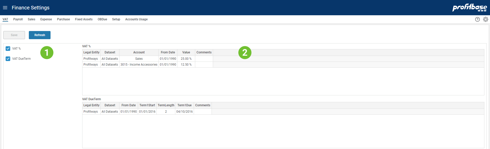

## Overview
VAT defines the settings related to Value Added Tax to set the VAT rate percent and payment term.
 

1. **Selecting Setting Table** The left area list the different setting tables available for the page. Ticking here will turn on and off the table.
2. **Tables View** The right area will display the selected tables and allows users to edit content.
 

## Descriptions

Each table and columns are described below.

Key columns used for matching when looking up correct setting is marked (k).

#### VAT %
This table defines the VAT rate percent. It is possible to differentiate between legal Entities, datasets and accounts. FromDate is used when the rate has changed over time.

Columns:

- **Legal Entity (k)** 
Legal Entity that are eligible for paying VAT.
- **Dataset (k)** 
Dataset is one of 'Forecast' or 'Budget'. Valid in:  Planner 4 or earlier.
- **Account (k)** 
Named group of accounts from Account dimension or individual accounts.
- **From Date (k)** 
The date from which the value is valid from.
- **Value** 
VAT percent value to be applied to the sales to calculate the VAT amount.
- **Comments** 
Free text string to help document settings.

The table above shows that all Accounts under the Sales account group will have 25% VAT while the account 3015 will have 12,5%. Note that 3015 may also be part of Sales account group but will still get 12,5%.
 

#### VAT Due Term
This table defines the schedule for VAT payment.

Columns:

- **Legal Entity (k)** 
Legal Entity that are eligible for paying VAT.
- **Dataset (k)** 
Dataset is one of 'Forecast' or 'Budget'. Valid in:  Planner 4 or earlier.
- **From Date (k)** 
The date from which the value is valid from.
- **Term1Start** 
Date for the start of first term.
- **TermLength** 
Number of months for each term.
- **Term1Due** 
Due date for first term.
- **Comments** 
Free text string to help document settings.

The table above shows that the first VAT term is defined to start 2016-01-01. The term length is 2 months. The VAT payment is due 2016-04-10. To sum it up, VAT is due every 2 months on 10th one month and 10 days after term end.
