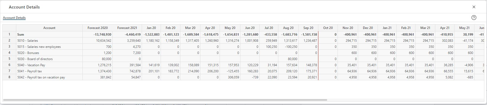

## Overview
This page displays forecast details per account for a given report line. 
The report will typically include transactions produced by multiple input modules.
 

 

- **Account:** 
The account of the forecasted transaction. 

- **Forecast this year ("2020" in the example):** 
This year's total, i.e. the sum of the periodic values for the year in question, actuals year to date + forecast rest of year.

- **Forecast next year ("2021" in the example):** 
Next year's total, i.e. the sum of the periodic values for the year in question. Next year is comprised of forecast periods only.

- **Periods ("Jan 20 - Dec 21" in the example):** 
The periodic values. Note that for the forecast process, the current years periods are comprised of actual periods and plan periods. A red vertical line indicates the cut off between actuals and plan.

 
