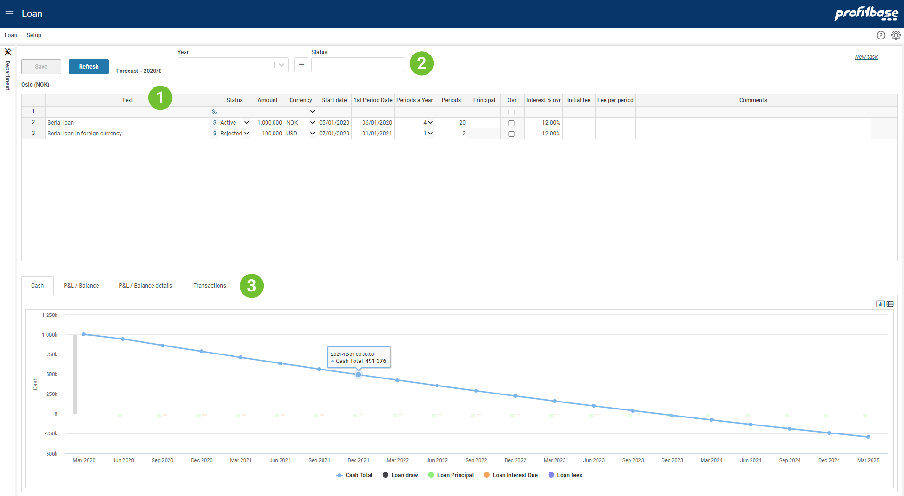

## Overview
This is the input module in which to plan loans.

 

1. **The loan description**  
Each loan should have a textual description so that they are identifiable. The Text column contains this description. 
2. **The loan status filter**  
Each loan has a status, for example Planned, Active, Rejected (subject to the solution configuration). The loan status filter is used to filter out loan of specific statuses.
The loan status filter is a multi-select filter which means that multiple loan statuses can be selected. 
3. **Attachment button**  
The attachment button will display the number of attachments associated with this input page in the current filter context. The current filter context is the selection made in the organizational filter (leftmost section) and the optional filters that are found in the rightmost section (subject to configuration).

To add a new attachment, click the attachment button and drag-then-drop the attachment from the file system onto the drop zone in the attachment dialogue.

To delete an attachment, click the attachment button, select the attachment and the click the Delete button (bin icon) within the attachment dialogue
4. **Report and trend section**
A set of reports and a trend are available and show the financial effect of the loans both in terms of Profit and Loss, Balance and Cash flow.
Select the appropriate tab to view the report or trend therein.

 

## Video
[Introduction - Input](https://profitbasedocs.blob.core.windows.net/enduserhelp/videos/Loan.mp4) 

 

## Column Descriptions

Note that the heading of the columns and their visibility can be configured and may thus differ from the example. 

- **Text:** 
Describes the loan (mandatory)
- **Financial report - "$" icon** 
The Financial report icon will trigger the reports and trend for the row clicked. Clicking the icon for the sum row, will trigger the reports for all rows.
- **Status.:** 
Each loan has a status, for example Planned, Active, Rejected (subject to the solution configuration). The loan status filter is used to filter out loan of specific statuses.
- **Amount:** 
Loan amount (mandatory)
- **Currency:** 
The currency of the loan amount.
- **Start date:** 
Start date for loan  (mandatory)
- **1st Period Date:** 
Date of first period/rollover. This date must be within the firsts period (mandatory)
- **Periods a Year:** 
Number of periods/rollovers a year  (mandatory)
- **Periods:** 
Number of periods/rollovers in total for the loan lifecycle  (mandatory)
- **Principal:** 
Applies to serial loan only and only if you would like to override the principal. By default, the module calculates the principal to be the Amount divided by the Periods.  
If you choose to set a lower principal than the default, the residual balance of the loan will be fulfilled at the last rollover. 
This field in not editable if the "Override principal serial" function is used, see column immediately below.
- **Ovr.:** 
Indicates whether the "Override principal serial" function is used, e.g. for defining specific and/or varying principals over the lifecycle of the loan.  
A mouse right-click over this column will reveal the "Override principal serial" menu which takes you to a pop-up window in which you can define a specific principal plan for the current loan.
- **Interest % ovr:** 
The annual interest rate % (override) for the loan. Subject to configuration there be central settings for interest rate %. The override value will "win out" regardless of any central settings.
- **Initial fee:** 
Initial (one-off) fee at start of the loan.
- **Fee per period:** 
Periodic fee per rollover of the loan.
- **Comments:** 
Input field enabling textual comments to be associated with the input for a specific line.

 

## How to`s

 

> [Create new task](/planner/workbooks/process-and-tasks/tasks/create-edit-task) 

**Applies to:**  Planner 5.4 or later
> [Configure the loan module](https://profitbasedocs.blob.core.windows.net/enduserhelp/files/V5.4/Planner%20Loan%20module.pdf) 

**Applies to:**  Planner 5.2.4 or later
> [Configure the loan module](https://profitbasedocs.blob.core.windows.net/enduserhelp/files/V5.2.4/Planner%20Loan%20module.pdf) 

**Applies to:**  Planner 5.2 
> [Configure the loan module](https://profitbasedocs.blob.core.windows.net/enduserhelp/files/V5.2/Planner%20Loan%20module.pdf) 

**Applies to:**  Planner 5.0 or 5.1
> [Configure the loan module](https://profitbasedocs.blob.core.windows.net/enduserhelp/files/v5/Planner%20Loan%20module.pdf) 

**Applies to:**  Planner 4.x
> [Configure the loan module](https://profitbasedocs.blob.core.windows.net/enduserhelp/files/Planner%20Loan%20module.pdf) 

