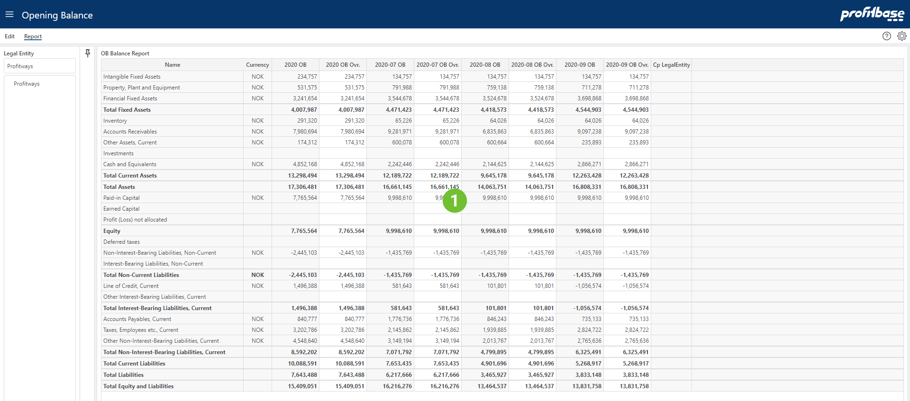

## Overview
Here you can see the opening balance including any overrides presented using the balance report.  
 

1. **Description**  
This is using the report layout configuration for the Balance report. Accounts from the edit is aggregated and present as report line sums here.
 

## Column Descriptions

- **Name** 
Report line name
- **Currency** 
Currency for the amounts.
- **Year OB** 
Last full year opening balance.
- **Year OB Ovr.:** 
Last full year opening balance with overrides.
- **YYYY-MM OB:** 
3 last month's opening balance.
- **Month OB Ovr.:** 
3 last month's opening balance with overrides.
- **Cp LegalEntity:** 
Counterparty legal entity.
 
