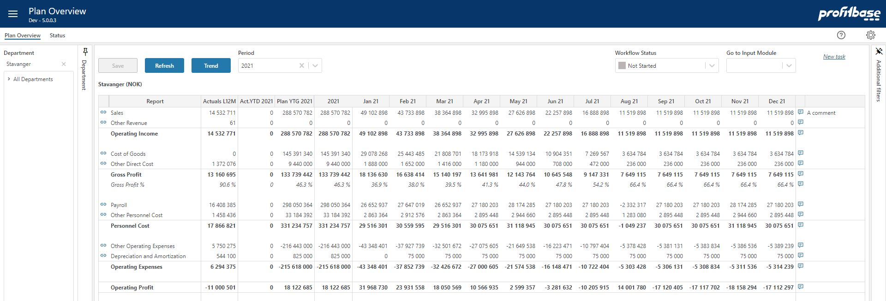

## Overview
This is the Profit and Loss overview page for the plan process. It acts as a summary for the planning done so far as well as a navigation page to the various input modules used for detailing the plan. The summary is, with exception of the Comment column, read only.
 

1. **The summary report**  
A Profit and Loss summary report that displays the plan input done so far. It contains a set of profit and loss report lines (rows) that either sums a range of accounts or act as a calculation of other report lines. The profit and loss setup will vary from solution to solution.
2. **Trend**  
The Trend button takes you in to the Trend pop up page in which it is possible to trend the development of various report lines over time. It will vary from solution to solution which report lines are enabled for trending.
3. **Year filter**  
The Year filter drop down selection enables you to select which (time) part of the forecast that you would like to see. Selecting this year or next year, will drill to the month level for the chosen year.
4. **Workflow**  
The workflow enables you to set the state of the plan. The state set will be propagated to the input modules associated with the solution for the department currently selected. Setting the state to Finished will by default disable any further input to the input modules (depends on user's access level).
5. **Go to input module**  
Launch drop down selector for launching specific input modules. When selecting an input module from the drop down, the input module will launch and replace the Summary.
6. **Additional filters**  
In the rightmost section of the workbook, an expandable section contains additional slicer filters that can be used to slice the overview and to set a specific context for accessing the various input modules. Note that the use of additional filters is configurable and will vary from solution to solution.

 

## Column Descriptions

- **Report** 
By clicking the Report column (one of the report lines) or the link icon to its left, the input module associated with that report line will launch and replace the summary page. This would be the normal procedure when you want to view input details or perform detailed input to that report line. The input module can also be launched in a new window by right-clicking the link symbol and selecting the "Open in new window" option

- **Actuals L12M** 
The actual total from the last 12 calendar months before the start of the plan period.

- **Act.YTD** 
“Actuals Year-to-date” is the actuals, leading up to the start of the plan period.

- **For.YTG**  
Plan from the start of the plan period to the end of this year.

- **This year (label vary with year, 2021 in the example)**  
Plan for this year, that is Act.YTD + For.YTG

- **Next year (label vary with year and configuration, not shown in the example)**  
Plan for next year, that is the sum of the plan input for next year. It will vary from solution to solution whether next year's plan is enabled and thus visible.

- **Long term plan (labels vary, not shown in the example)**  
Long term plan, that are the year totals of plan input for years beyond next year. It will vary from solution to solution whether long term planning is enabled and thus visible.

- **Comment**  
Comment-icon and display-column for the current comment for a specific report line. To edit the comments, click the Comments icon and enter the comment in the Comments pop-up. Click the "Save" button in the Comments pop-up to save the changes. Note that comments are sensitive to the context selected, i.e. the selection mad in the organizational and additional filters. Comments can be added at any level in the organizational structure.

## How to`s

 

[Create new task](/planner/workbooks/process-and-tasks/tasks/create-edit-task) 

> **Input Modules** 
> [How to plan driver based](/planner/modules/driver-based/drivers) 
> [How to plan personnel](/planner/modules/personnel/personnel-details) 
> [How to plan on accounts](/planner/modules/account/account-details) 

