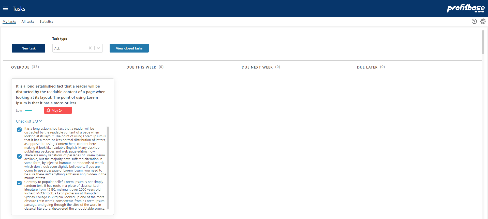

## Overview
This workbook is used to manage all assigned tasks.
 

1. "My Tasks" is the front page and displays an overview of all tasks assigned to the logged in user, in the form of a "card view".
2. "All Tasks" is a list overview of all currently assigned tasks and can be used to find any task using the provided filters.
3. "Statistics" contains two pie charts, one showing the usage of task types (interactive), and one showing their status with regards to due dates.

 

Some tasks will be automatically pushed to users from the process tasks, which are recurring tasks distributed on a schedule.
 
Other tasks can be created and assigned to users on an "ad-hoc" basis.

## Related Pages
- [My tasks](/planner/workbooks/process-and-tasks/tasks/my-tasks)
- [All tasks](/planner/workbooks/process-and-tasks/tasks/all-tasks)
- [Statistics](/planner/workbooks/process-and-tasks/tasks/statistics)
- [Create or edit task](/planner/workbooks/process-and-tasks/tasks/create-edit-task)
