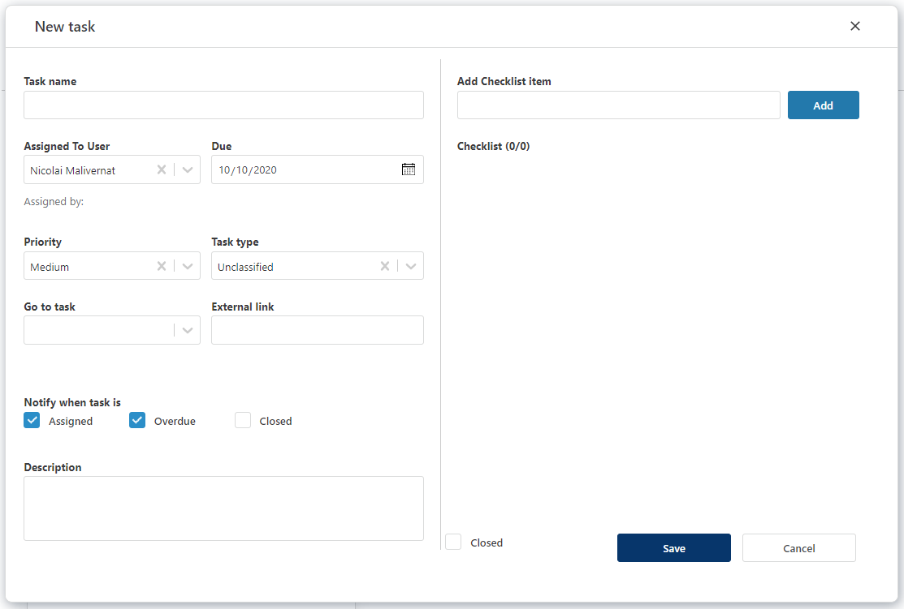

## Overview
The form used to create tasks may be opened from several workbooks in the system, using the "**New task**" link. 

 

If the task is created from another workbook, context variables will be included, such as the selected filters (year, month, department, etc) 
and the "<b>Go to task</b>" link will include these values.

 

The task form fields: 
 

## Field Descriptions
 

1. **Task name**
  
A short header for the task.
  
2. **Assigned to user** 
 
Select the user from the list to whom you wish to assign the task.
3. **Due**
 
The "deadline" date for the task.
 
4. **Priority**
 
Low, Medium, High. Default is "Medium". 
 
5. **Task Type**
 
Customizable types, with some pre-defined types, such as "Budget", "Forecast", etc.
 
When the task is created from a **Planner** workbook, this will be pre-selected, but may be changed by the creator of the task.
 
6. **Go to task** or **External link**
 
This field will provide a link to a workbook or external site where the task should be completed. 
 
"Go to task" will be pre-populated if coming for another workbook.
 
Select a workbook **or** use an external link (example: SharePoint, other system, etc)
7. **Notifications**
 
"Assigned": an email will be instantly sent to the assigned user (default: on).
 
"Overdue": an email notification to the assigned user when the task is overdue (default: on). 
 
"Closed": an email notification to the  **assigner** when the assignee has completed the task (default: off).
 
8. **Description**
A bigger text field, if the task requires more explanations.
 
9. **Checklist** (right pane)
 
Detailed steps describing the task. The assignee will be able to mark each step as complete using checkboxes. 
