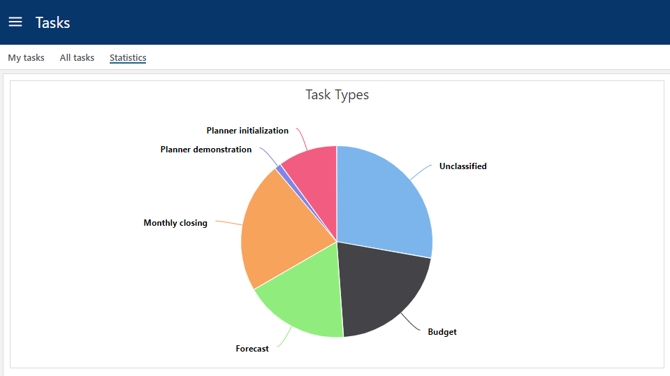
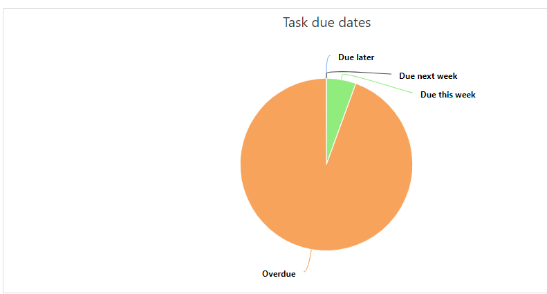

# Overview
Two pie charts. One showing the usage of task types and the other gives an overview of task due dates.
 

1. **Task types**  

 
This chart is interactive and clicking a type will take you to the "All tasks" page with the filter set to the chosen type.
 
 

2. **Due dates**  

 
